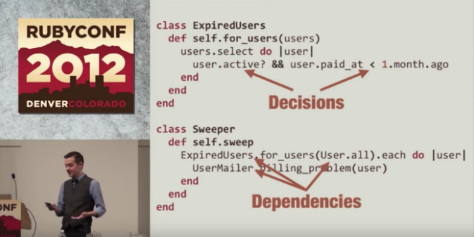

Here are a couple talks with “ah-ha” moments that made me think about programming in a new way.

## Cheng Lou — “On the Spectrum of Abstraction”

<iframe width="560" height="315" src="https://www.youtube.com/embed/mVVNJKv9esE" frameborder="0" allow="accelerometer; autoplay; encrypted-media; gyroscope; picture-in-picture" allowfullscreen></iframe>

This talk is particularly useful for library and framework authors, as it delves into how to think about the level of abstraction a library should provide. That doesn’t sound widely applicable at first, but as complex client side apps emerge, it’s becoming more and more common for frontend developers to write generic component libraries and to have to think about what functionality and what abstractions they provide.

The idea that really resonated with me is the visualization of a tree of “use cases”, where leaf nodes are concrete use cases and parent nodes are the abstract tools that enable those use cases. If you create a tool that’s very specific and tailored, you only cover a few leaf nodes. If you create a tool that’s very abstract, you can potentially cover many leaf nodes, but there will then be additional layers of abstraction between the tool and the eventual leaf node use-case. A library should strike the balance between that immediate usefulness, and the ability to cover many “leaf nodes”. I found this to be an interesting and useful mental image to have.

Another core idea was that enforcing restrictions on expressivity can be a beneficial tool. The corollary to that idea is that increasing expressiveness can be a negative trade-off. The prime example is how React approaches rendering vs. the approach of using templates. Templates are “data” — they can be fully expressed as serializable data structures, whereas React rendering can utilize functions, which can’t be expressed as data. Cheng said that this was actually a concession, not an inherently desired trait, which was something that was unexpected and thought provoking. By restricting expressiveness by using templates, frameworks like Ember can apply performance optimizations that React cannot. But the expressiveness gained with functions was worth the tradeoff.

## Sandi Metz — ”The Wrong Abstraction”

On the topic of abstractions — [The Wrong Abstraction](https://www.sandimetz.com/blog/2016/1/20/the-wrong-abstraction) is based a talk by Sandi Metz. The idea is straightforward: it’s better to have code duplication than to have code reuse at the “wrong level of abstraction”, sharing code across disparate areas when the code really shouldn’t be shared at all.

The idea that I found enlightening was the solution to the problem:

> If you find yourself in this situation, resist being driven by sunk costs. When dealing with the wrong abstraction, the fastest way forward is back.

She suggests re-introducing duplication by inlining the abstracted code back into every caller. This approach is interesting because it’s rather obvious in principle, but something that I wouldn’t have thought of when approaching a particular chunk of over-shared code in practice.

## Gary Bernhardt — “Boundaries”

<iframe width="560" height="315" src="https://www.youtube.com/embed/yTkzNHF6rMs" frameborder="0" allow="accelerometer; autoplay; encrypted-media; gyroscope; picture-in-picture" allowfullscreen></iframe>

This talk covers a wide range of concepts: “functional core vs. imperative shell”, immutability, and parallelism. The concept I found most immediately applicable were Gary’s thoughts about integration tests vs. unit tests and mocking/stubbing.

Going into the talk, I was strongly on board with integration testing as the best primary means of testing. However, Gary’s illustration of the exponential “path count” that’s inherent to integration testing and the increased cost in test suite runtime are solid arguments against an extremely integration-heavy approach, and are problems that I’ve run into in my own experience as well.

Instead, Gary suggests a balanced approach to unit and integration testing. This is the slide that really nailed down the concept:

Gary’s argument here is that you put all your “decisions” in a functional core — the stuff that also tends to lead to an exponential explosion in testing paths. And you unit test that, because unit testing is fast and well-suited for testing multiple paths.

With that done, you can test the integration of dependencies using integration tests and avoid the exponential branching paths (since that’s covered by unit tests).
